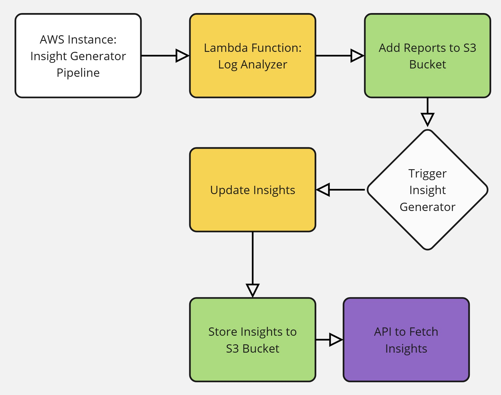

# Insights Generator
  
A serverless application that processes Excel files from S3, generates insights using Google's Gemini AI, and creates PDF reports. This application is designed to run as an AWS Lambda function and is containerized using Docker.

## Overview

The Insights Generator performs the following operations:
1. Downloads Excel files from a specified S3 bucket
2. Consolidates data from multiple Excel sheets
3. Processes the consolidated data using Google's Gemini AI
4. Generates a PDF report
5. Uploads the final report to another S3 bucket

## Prerequisites

- AWS Account with appropriate permissions
- Google Cloud Project with Gemini API enabled
- Docker installed (for local development and building)
- Python 3.10+
- Required environment variables:
  - `AWS_ACCESS_KEY_ID`
  - `AWS_SECRET_ACCESS_KEY`
  - `AWS_REGION`
  - `gemini_key` (Google Cloud API key)

## Installation

1. Clone the repository:
```bash
git clone <repository-url>
cd insights-generator
```

2. Create and configure the `.env` file:
```bash
gemini_key=your-gemini-api-key
```

3. Build the Docker image:
```bash
docker build -t insights-generator .
```

## Project Structure

```
insights_generator/
├── lambda_function.py    # Main Lambda function
├── test.py              # Local testing script
├── requirements.txt     # Python dependencies
├── Dockerfile          # Container configuration
├── .env               # Environment variables
└── submodules/        # Supporting modules
    ├── gemini_request.py
    └── md_to_pdf.py
```

## Configuration

### S3 Buckets
The application expects two S3 buckets:
- `flipkart-reports`: Source bucket containing Excel files
- `flipkart-insights`: Destination bucket for generated PDF reports

### Excel File Format
- Files should be named in the format: `{device_name}_{batch_no}.xlsx`
- Each Excel file should contain a sheet named "Items Sheet"

## Development

For local development and testing, use `test.py`:
```bash
python test.py
```

## Deployment

1. Push the Docker image to Amazon ECR:
```bash
aws ecr get-login-password --region region | docker login --username AWS --password-stdin aws_account_id.dkr.ecr.region.amazonaws.com
docker tag insights-generator:latest aws_account_id.dkr.ecr.region.amazonaws.com/insights-generator:latest
docker push aws_account_id.dkr.ecr.region.amazonaws.com/insights-generator:latest
```

2. Create or update your Lambda function to use the container image

## Security Notes

- Ensure proper IAM roles and permissions are configured for the Lambda function
- Keep the `.env` file secure and never commit it to version control
- Follow AWS best practices for S3 bucket policies
- Regularly rotate API keys and credentials
